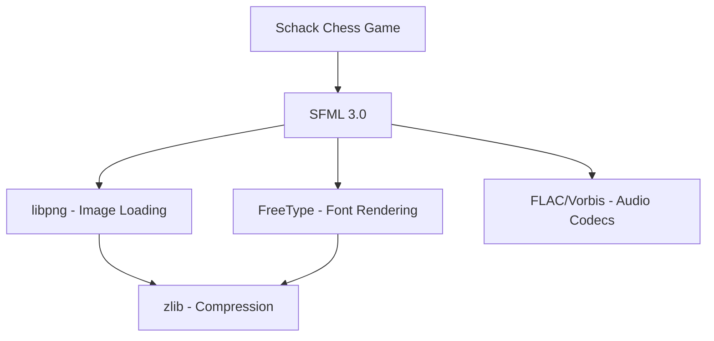
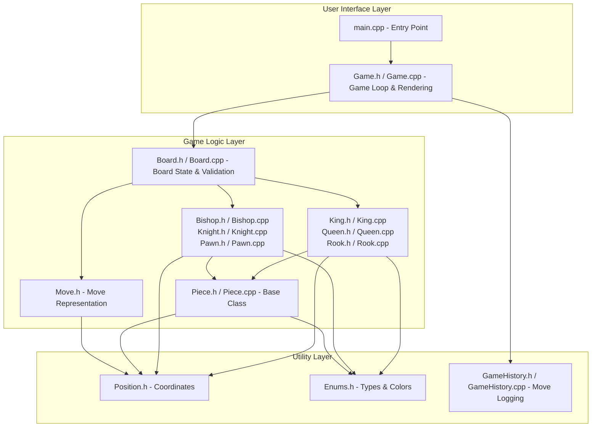
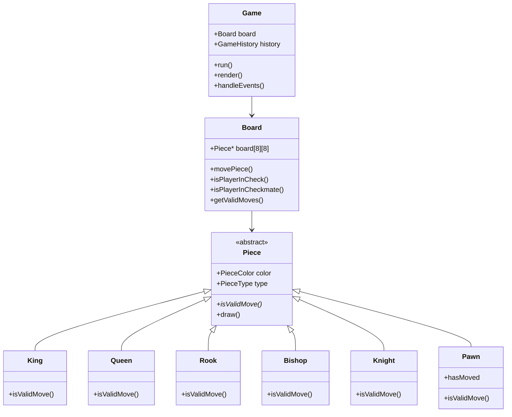
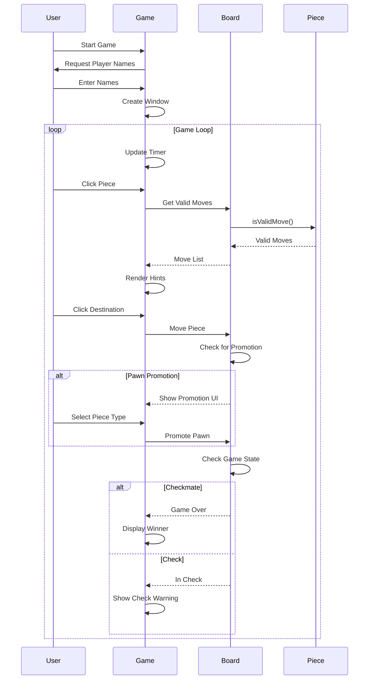

# ♟️ Chess Game - C++ SFML

A professional chess game built with modern C++ and SFML 3.0, featuring Chess.com-inspired UI, move validation, timers, and game history tracking.

[](https://github.com/Mouaz7/chess-game)
[](https://www.sfml-dev.org/)
[](LICENSE)
[](https://github.com/Mouaz7/chess-game)

---

## 📑 Table of Contents

- [Language Statistics](#-language-statistics)
- [Features](#-features)
- [Technology Stack](#️-technology-stack)
- [Game Architecture](#️-game-architecture)
- [Prerequisites](#-prerequisites)
- [Installation](#-installation)
- [Building & Running](#-building--running)
  - [Option 1: Visual Studio 2022](#option-1-visual-studio-2022-community-recommended-for-beginners)
  - [Option 2: Visual Studio Code](#option-2-visual-studio-code-lightweight-alternative)
  - [Option 3: PowerShell Script](#option-3-powershell-script-fastest)
  - [Option 4: Manual Build](#option-4-manual-build)
- [How to Play](#-how-to-play)
- [Project Structure](#-project-structure)
- [Troubleshooting](#-troubleshooting)
- [Contributing](#-contributing)
- [License](#-license)
- [Acknowledgments](#-acknowledgments)
- [Contact](#-contact)

---

## 📊 Language Statistics


This project is written in **96.2% modern C++**, utilizing object-oriented programming principles with classes, inheritance, polymorphism, and templates.

---

## ✨ Features

### Core Chess Functionality

- ✅ **All standard chess rules** - Complete piece movements (King, Queen, Rook, Bishop, Knight, Pawn)
- ✅ **Special moves** - Castling (kingside & queenside) and en passant fully implemented
- ✅ **Checkmate & stalemate detection** - Automatic game-end detection
- ✅ **Legal move validation** - Prevents illegal moves that leave king in check
- ✅ **Pawn promotion** - Interactive UI to promote pawns to Queen, Rook, Bishop, or Knight
- ✅ **Draw conditions** - Insufficient material, 50-move rule, threefold repetition

### Visual Features

- 🎨 **Chess.com-inspired UI** - Classic green board theme with professional aesthetics
- 🖥️ **Fullscreen support** - Resizable window with proper aspect ratio scaling
- 👁️ **Move hints** - Visual indicators showing legal moves (dots for empty squares, rings for captures)
- ⚠️ **Check warnings** - Red border around king + "CHECK!" text when in check
- 📊 **Material advantage display** - Real-time score showing which player is ahead
- 🏆 **Winner display** - Clear, large text showing game outcome

### Game Management

- ⏱️ **Chess clock** - 10-minute timer per player with active-turn highlighting
- 👥 **Player customization** - Enter custom player names at startup
- 📝 **Move history** - Automatic logging of all moves to `game_history.txt`
- 🏁 **Match results** - Game outcomes saved to `match_results.txt`

---

## 🛠️ Technology Stack

### Programming Language

**C++20** - Modern, Object-Oriented C++ with advanced features:

#### Object-Oriented Programming (OOP)

- **Classes & Objects** - Well-structured class hierarchy for game entities
- **Inheritance** - `Piece` base class inherited by `King`, `Queen`, `Rook`, `Bishop`, `Knight`, `Pawn`
- **Polymorphism** - Virtual functions (`isValidMove()`, `getType()`, `getSymbol()`)
- **Encapsulation** - Private/protected members with public interfaces
- **Abstraction** - Abstract base class `Piece` with pure virtual functions

#### Modern C++ Features

- **Smart pointers** (`std::unique_ptr`) for automatic memory management
- **Templates** for type-safe generic programming (`Position<T>`)
- **RAII** (Resource Acquisition Is Initialization) for resource safety
- **Lambda expressions** and modern STL containers
- **No manual `new`/`delete`** - zero memory leaks
- **Move semantics** for efficient resource transfer

### Graphics & Multimedia

**SFML 3.0** (Simple and Fast Multimedia Library)

- Cross-platform C++ library for 2D graphics
- Window management and event handling
- Texture loading and sprite rendering
- Text rendering with TrueType fonts
- Shape primitives for UI elements

### Build System & Tools

| Tool                   | Purpose                                     |
| ---------------------- | ------------------------------------------- |
| **Visual Studio 2022** | Primary IDE with MSVC v143 compiler         |
| **MSBuild**            | Microsoft's build engine for C++ projects   |
| **vcpkg**              | Modern C++ package manager for dependencies |
| **Git**                | Version control system                      |
| **PowerShell**         | Build automation scripts                    |

### Dependencies (Auto-installed via vcpkg)



All dependencies are automatically managed by vcpkg:

- **SFML** - Main graphics framework
- **FreeType** - Font rendering for text
- **libpng** - PNG image support for chess pieces
- **zlib, brotli** - Compression libraries
- **FLAC, Vorbis, Ogg** - Audio codec libraries

---

## 🏗️ Game Architecture

### High-Level Component Diagram



### Class Hierarchy



### Game Flow



---

## 📦 Prerequisites

### Required Software

1. **Windows 10/11** (64-bit)
2. **Git** - [Download here](https://git-scm.com/downloads)
3. **Visual Studio 2022** (Community/Professional/Enterprise)
   - Install **Desktop development with C++** workload
   - Include **MSVC v143 – VS 2022 C++ x64/x86 build tools**
   - Include **Windows 10 SDK**
4. **vcpkg** - C++ package manager

### Installing vcpkg

Open PowerShell and run:

```powershell
# Clone vcpkg
git clone https://github.com/microsoft/vcpkg.git $env:USERPROFILE\vcpkg

# Navigate to vcpkg
cd $env:USERPROFILE\vcpkg

# Bootstrap vcpkg
.\bootstrap-vcpkg.bat

# Integrate with Visual Studio
.\vcpkg integrate install
```

### Installing SFML 3.0

```powershell
# Set environment variables
$env:VCPKG_ROOT = "$env:USERPROFILE\vcpkg"
$env:VCPKG_DEFAULT_TRIPLET = "x64-windows"

# Install SFML
.\vcpkg install sfml:x64-windows
```

> ⏱️ **Note**: SFML installation takes 5-10 minutes and requires ~120 MB disk space.

---

## 📥 Installation

### Clone the Repository

```powershell
git clone https://github.com/Mouaz7/chess-game.git
cd chess-game
```

### What You Get

```
chess-game/
├── 📄 Header Files (.h)
│   ├── Game.h                # Game loop & UI declarations
│   ├── Board.h               # Chess logic declarations
│   ├── Piece.h               # Base class declarations
│   ├── King.h, Queen.h       # Individual piece declarations
│   ├── Rook.h, Bishop.h      # Individual piece declarations
│   ├── Knight.h, Pawn.h      # Individual piece declarations
│   ├── Position.h            # Coordinates template
│   ├── Move.h                # Move data
│   ├── Enums.h               # Enumerations
│   └── GameHistory.h         # Move logging declarations
│
├── 📄 Implementation Files (.cpp)
│   ├── main.cpp              # Entry point
│   ├── Game.cpp              # Game loop & UI implementation
│   ├── Board.cpp             # Chess logic implementation
│   ├── Piece.cpp             # Base class implementation
│   ├── King.cpp, Queen.cpp   # Individual piece implementations
│   ├── Rook.cpp, Bishop.cpp  # Individual piece implementations
│   ├── Knight.cpp, Pawn.cpp  # Individual piece implementations
│   └── GameHistory.cpp       # Move logging implementation
│
├── 🖼️ Assets
│   └── assets/               # Chess piece images (PNG)
│
├── ⚙️ Configuration
│   ├── vcpkg.json            # Dependencies manifest
│   ├── Schack.vcxproj        # Visual Studio project
│   ├── Schack.vcxproj.filters
│   └── .gitignore            # Git ignore rules
│
├── 🔧 Scripts
│   ├── build_and_run.ps1     # Build automation
│   └── find_msbuild.ps1      # MSBuild locator
│
└── 📚 Documentation
    ├── README.md             # This file
    └── LICENSE               # MIT License
```

### Auto-Generated Files (Not in Git)

These are created when you build/run:

- `vcpkg_installed/` - SFML libraries (~120 MB)
- `x64/Debug/` or `x64/Release/` - Compiled executables
- `game_history.txt` - Your game moves
- `match_results.txt` - Game outcomes

---

## 🚀 Building & Running

### Option 1: Visual Studio 2022 Community (Recommended for Beginners)

#### Download and Install

1. **Download Visual Studio 2022 Community** (Free!)

   - Visit: [visualstudio.microsoft.com](https://visualstudio.microsoft.com/)
   - Download **Visual Studio 2022 Community Edition** (completely free)

2. **Install Required Components**

   During installation, select these workloads:

   - ✅ **Desktop development with C++**

   Under "Individual components", make sure these are checked:

   - ✅ **MSVC v143 - VS 2022 C++ x64/x86 build tools (Latest)**
   - ✅ **Windows 10 SDK** (or Windows 11 SDK)
   - ✅ **C++ CMake tools for Windows** (optional but recommended)

3. **Language Settings**

   Visual Studio Community supports multiple languages:

   - **Default**: English (recommended for programming)
   - **Change language**: Tools → Options → Environment → International Settings
   - **Note**: Keep IDE in English for easier debugging, but comments can be in any language

#### Open the Project

1. **Launch Visual Studio 2022 Community**

   - Start menu → Visual Studio 2022

2. **Open the Chess Project**

   **Method A - Use Solution File** (Easiest):

   - Click **File → Open → Project/Solution**
   - Navigate to your cloned repository folder
   - Select `Schack.sln` (Solution file)
   - Click **Open**

   **Method B - Use Folder**:

   - Click **File → Open → Folder**
   - Select the project folder
   - Visual Studio will automatically detect the project

3. **Wait for Project to Load**
   - Visual Studio will index files (1-2 minutes first time)
   - You'll see "Ready" in the bottom left corner when complete

#### Build the Project

1. **Select Build Configuration**

   In the toolbar at the top (near the green play button):

   - **Configuration**: Select **Release** (not Debug)
     - Release = Optimized, faster performance
     - Debug = Slower, but easier to debug
   - **Platform**: Select **x64** (not x86)
     - x64 = 64-bit (required for this project)

2. **Build Solution**

   Choose a method:

   - **Keyboard**: Press `Ctrl+Shift+B`
   - **Menu**: Build → Build Solution
   - **Right-click**: Solution Explorer → Right-click "Schack" → Build

3. **Check Build Output**

   - Look at the **Output** window (View → Output if not visible)
   - Successful build shows: `Build: 1 succeeded, 0 failed`
   - If errors occur, check [Troubleshooting](#-troubleshooting)

#### Run the Game

1. **Start the Game**

   Choose a method:

   - **Without Debugger** (Faster): Press `Ctrl+F5`
   - **With Debugger** (For development): Press `F5`
   - **Menu**: Debug → Start Without Debugging

2. **Enter Player Names**

   - A console window appears first
   - Type white player's name → Press Enter
   - Type black player's name → Press Enter
   - Game window opens automatically

3. **Play Chess!**

   - The graphical window appears
   - Click on pieces to move them
   - Enjoy!

#### Understanding the IDE

**Solution Explorer** (Right side):

```
Schack (Solution)
└── Schack (Project)
    ├── Header Files (.h)
    │   ├── Game.h          ← Main game logic
    │   ├── Board.h         ← Chess board
    │   ├── Pieces.h        ← Chess pieces
    │   └── ...
    ├── Source Files (.cpp)
    │   └── main.cpp        ← Program entry point
    └── Resource Files
        └── assets/         ← Chess piece images
```

**File Types**:

- `.h` files = **Header files** (declarations, interfaces)
- `.cpp` files = **Source files** (implementations)
- `.vcxproj` = **Project file** (Visual Studio configuration)
- `.sln` = **Solution file** (contains one or more projects)

### Option 2: Visual Studio Code (Lightweight Alternative)

Visual Studio Code is a lightweight, cross-platform code editor perfect for C++ development.

#### Prerequisites

1. **Install Visual Studio Code**

   - Download from: [code.visualstudio.com](https://code.visualstudio.com/)
   - Install for Windows

2. **Install Required Extensions**

   Open VS Code and install these extensions (Ctrl+Shift+X):

   - ✅ **C/C++** (by Microsoft) - IntelliSense, debugging, code browsing
   - ✅ **C++ Extension Pack** (by Microsoft) - Complete C++ development tools
   - ✅ **CMake Tools** (optional) - For CMake support

3. **Install Build Tools**

   You still need a C++ compiler. Choose one:

   **Option A - Visual Studio Build Tools** (Recommended):

   ```powershell
   # Download Visual Studio Build Tools from:
   # https://visualstudio.microsoft.com/downloads/
   # Select "Desktop development with C++" workload
   ```

   **Option B - MinGW-w64** (Alternative):

   ```powershell
   # Install via MSYS2
   winget install MSYS2.MSYS2
   # Then in MSYS2 terminal:
   pacman -S mingw-w64-x86_64-gcc
   ```

#### Open Project in VS Code

1. **Launch VS Code**

   ```powershell
   cd path\to\chess-game
   code .
   ```

2. **Configure C++ IntelliSense**

   VS Code will auto-detect your configuration. If not:

   - Press `Ctrl+Shift+P`
   - Type "C/C++: Edit Configurations (UI)"
   - Set compiler path to your MSVC or MinGW compiler

#### Build and Run

**Method A - Using Integrated Terminal**:

```powershell
# Open integrated terminal (Ctrl+`)
# Build with MSBuild
msbuild Schack.vcxproj /p:Configuration=Release /p:Platform=x64

# Run the game
.\x64\Release\Schack.exe
```

**Method B - Using Tasks** (Recommended):

1. Create `.vscode/tasks.json`:

   ```json
   {
     "version": "2.0.0",
     "tasks": [
       {
         "label": "Build Chess Game",
         "type": "shell",
         "command": "msbuild",
         "args": [
           "Schack.vcxproj",
           "/p:Configuration=Release",
           "/p:Platform=x64"
         ],
         "group": {
           "kind": "build",
           "isDefault": true
         },
         "problemMatcher": ["$msCompile"]
       },
       {
         "label": "Run Chess Game",
         "type": "shell",
         "command": "${workspaceFolder}\\x64\\Release\\Schack.exe",
         "dependsOn": ["Build Chess Game"]
       }
     ]
   }
   ```

2. **Build**: Press `Ctrl+Shift+B`
3. **Run**: Press `Ctrl+Shift+P` → "Tasks: Run Task" → "Run Chess Game"

**Method C - Using launch.json for Debugging**:

1. Create `.vscode/launch.json`:

   ```json
   {
     "version": "0.2.0",
     "configurations": [
       {
         "name": "Debug Chess Game",
         "type": "cppvsdbg",
         "request": "launch",
         "program": "${workspaceFolder}\\x64\\Debug\\Schack.exe",
         "args": [],
         "stopAtEntry": false,
         "cwd": "${workspaceFolder}",
         "environment": [],
         "console": "externalTerminal",
         "preLaunchTask": "Build Chess Game"
       }
     ]
   }
   ```

2. **Debug**: Press `F5`

#### VS Code Keyboard Shortcuts

| Shortcut       | Action                     |
| -------------- | -------------------------- |
| `Ctrl+Shift+B` | Build project              |
| `F5`           | Start debugging            |
| `Ctrl+F5`      | Run without debugging      |
| `Ctrl+``       | Toggle integrated terminal |
| `Ctrl+P`       | Quick file open            |
| `F12`          | Go to definition           |
| `Shift+F12`    | Find all references        |

### Option 3: PowerShell Script (Fastest)

```powershell
# Allow script execution (if needed)
Set-ExecutionPolicy -Scope Process -ExecutionPolicy Bypass

# Build and run
.\build_and_run.ps1
```

The script automatically:

- Locates MSBuild
- Builds in Release mode
- Launches the game

### Option 4: Manual Build

```powershell
# Find MSBuild
$msbuild = & "C:\Program Files\Microsoft Visual Studio\2022\Community\Common7\Tools\VsMSBuildCmd.bat"

# Build project
msbuild Schack.vcxproj /p:Configuration=Release /p:Platform=x64

# Run
.\x64\Release\Schack.exe
```

---

## 🎮 How to Play

### Starting the Game

1. Run the executable
2. Enter player names in the console:
   ```
   === CHESS GAME SETUP ===
   Enter White player name: Alice
   Enter Black player name: Bob
   ```
3. Game window opens automatically

### Making Moves

1. **Select a piece** - Click any piece to see valid moves (gray dots/rings)
2. **Move the piece** - Click a highlighted square
3. **Pawn promotion** - When a pawn reaches the end, choose: Queen/Rook/Bishop/Knight
4. **Check warning** - Red border appears around king when in check

### Game Features

| Feature               | Description                                       |
| --------------------- | ------------------------------------------------- |
| ⏱️ **Timer**          | 10 minutes per player, counts down on active turn |
| 📊 **Material Score** | Shows who's ahead (e.g., "+3" for White)          |
| ⚠️ **Check Warning**  | Red border + "CHECK!" text                        |
| 🏆 **Game Over**      | Large yellow text shows winner                    |
| 🖥️ **Fullscreen**     | Click maximize or drag window edges               |

### Keyboard Shortcuts

| Key   | Action                    |
| ----- | ------------------------- |
| `S`   | Save game history         |
| `R`   | Reset game                |
| `ESC` | Exit (auto-saves results) |

---

## 📁 Project Structure

### Core Components

```
src/
├── main.cpp              # Entry point, initializes Game

├── Header Files (.h) - Declarations only
│   ├── Game.h            # Game loop, rendering, events, timers
│   ├── Board.h           # Board state, move validation, check detection
│   ├── Piece.h           # Abstract base class for all pieces
│   ├── King.h            # King piece declaration
│   ├── Queen.h           # Queen piece declaration
│   ├── Rook.h            # Rook piece declaration
│   ├── Bishop.h          # Bishop piece declaration
│   ├── Knight.h          # Knight piece declaration
│   ├── Pawn.h            # Pawn piece declaration
│   ├── Position.h        # Template class for (row, col) coordinates
│   ├── Move.h            # Move representation with metadata
│   ├── Enums.h           # PieceColor, PieceType enumerations
│   └── GameHistory.h     # Move history tracking declarations

└── Implementation Files (.cpp) - Method definitions
    ├── Game.cpp          # Game loop & UI implementation
    ├── Board.cpp         # Chess logic implementation
    ├── Piece.cpp         # Base class implementation
    ├── King.cpp          # King piece logic
    ├── Queen.cpp         # Queen piece logic
    ├── Rook.cpp          # Rook piece logic
    ├── Bishop.cpp        # Bishop piece logic
    ├── Knight.cpp        # Knight piece logic
    ├── Pawn.cpp          # Pawn piece logic
    └── GameHistory.cpp   # Move logging implementation
```

### Design Patterns

- **Factory Pattern** - Dynamic piece creation
- **Strategy Pattern** - Each piece has unique move logic
- **RAII** - Smart pointers for memory safety
- **Polymorphism** - Virtual functions for piece behavior
- **Template Programming** - Generic Position class
- **Separation of Concerns** - Interface (.h) separated from implementation (.cpp)

---

## 🐛 Troubleshooting

### Build Issues

| Problem              | Solution                                     |
| -------------------- | -------------------------------------------- |
| MSBuild not found    | Install Visual Studio 2022 with C++ workload |
| SFML headers missing | Run `vcpkg integrate install`                |
| Permission denied    | Run PowerShell as Administrator              |
| DLL not found        | Build in x64 mode, check vcpkg integration   |

### Runtime Issues

| Problem                   | Solution                                             |
| ------------------------- | ---------------------------------------------------- |
| Window not responding     | Normal - enter player names in console first         |
| Pieces not visible        | Ensure `assets/` folder is in same directory as .exe |
| Fullscreen issues         | Click maximize button or drag window edges           |
| Mouse clicks wrong square | This is a known issue, restart the game              |

### Clean Build

If you encounter persistent issues:

```powershell
# Delete build artifacts
Remove-Item -Recurse -Force x64, vcpkg_installed

# Rebuild
.\build_and_run.ps1
```

---

## 🤝 Contributing

We welcome contributions! Here's how:

1. **Fork** the repository
2. **Create** a feature branch: `git checkout -b feature/amazing-feature`
3. **Make** your changes
4. **Test** thoroughly: `.\build_and_run.ps1`
5. **Commit**: `git commit -m "Add amazing feature"`
6. **Push**: `git push origin feature/amazing-feature`
7. **Submit** a Pull Request

### Code Guidelines

- ✅ Use C++20 features
- ✅ Follow existing code style
- ✅ Add comments for complex logic
- ✅ No build warnings
- ✅ Test all changes

---

## 📄 License

MIT License - See [LICENSE](LICENSE) file for details.

You may use, modify, and distribute this code freely.

---

## 🙏 Acknowledgments

- **SFML Team** - For the amazing graphics library
- **Chess.com** - UI design inspiration
- **vcpkg Team** - For simplifying C++ dependency management

---

## 📧 Contact

**Project Link**: [https://github.com/Mouaz7/chess-game](https://github.com/Mouaz7/chess-game)

---

**Enjoy playing chess!** ♟️🎮

Made with ❤️ using C++20 and SFML 3.0
