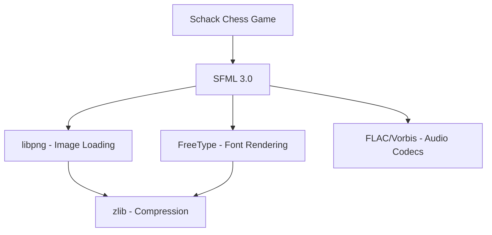
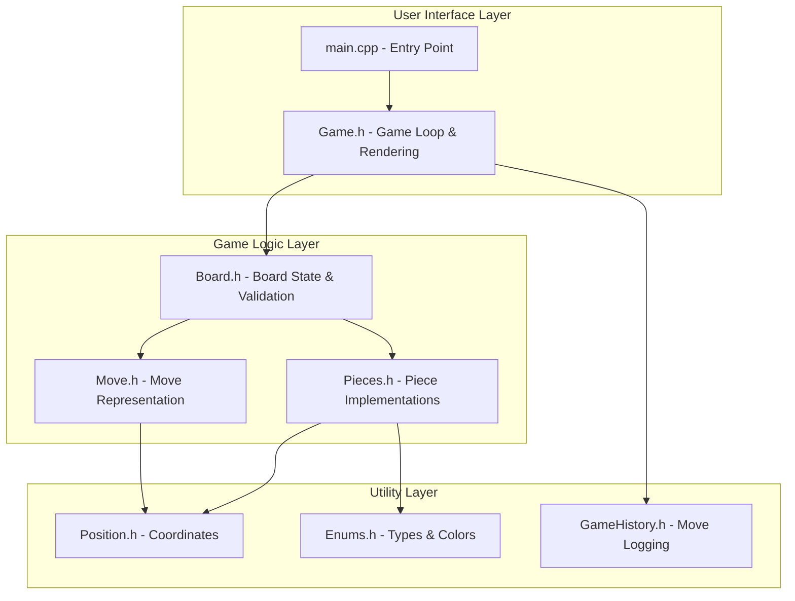
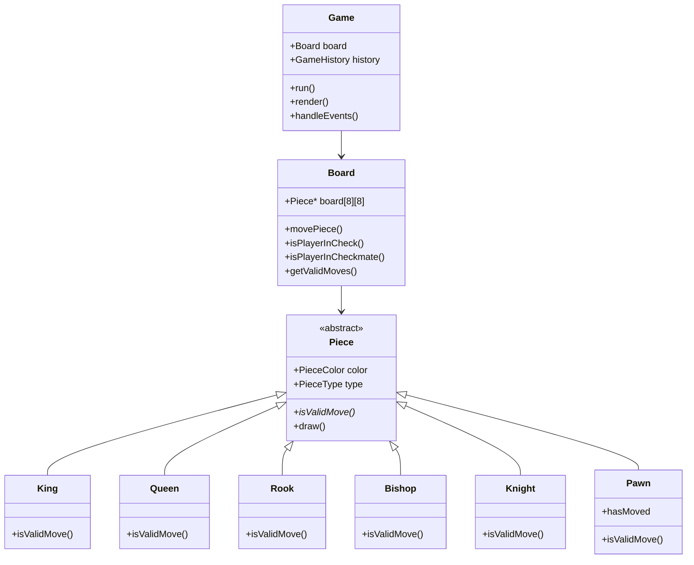
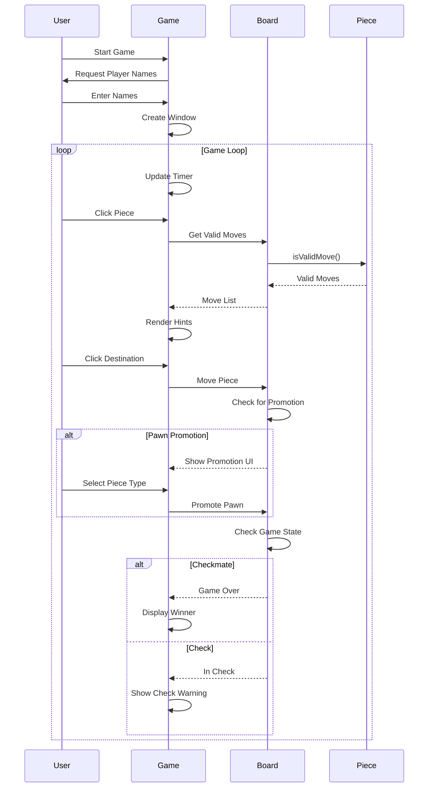

# ♟️ Schack – Modern Chess Game

A feature-rich chess application built with **C++20** and **SFML 3.0**, featuring a Chess.com-inspired interface with fullscreen support, pawn promotion, and visual check warnings.

   

---

## 📋 Table of Contents

- [Features](#-features)
- [Technology Stack](#-technology-stack)
- [Game Architecture](#-game-architecture)
- [Prerequisites](#-prerequisites)
- [Installation](#-installation)
- [Building & Running](#-building--running)
- [How to Play](#-how-to-play)
- [Project Structure](#-project-structure)
- [Troubleshooting](#-troubleshooting)
- [Contributing](#-contributing)
- [License](#-license)

---

## ✨ Features

### Core Chess Functionality

- ✅ **Complete chess rules** - All standard chess moves including castling, en passant
- ✅ **Checkmate & stalemate detection** - Automatic game-end detection
- ✅ **Legal move validation** - Prevents illegal moves that leave king in check
- ✅ **Pawn promotion** - Interactive UI to promote pawns to Queen, Rook, Bishop, or Knight

### Visual Features

- 🎨 **Chess.com-inspired UI** - Classic green board theme with professional aesthetics
- 🖥️ **Fullscreen support** - Resizable window with proper aspect ratio scaling
- 👁️ **Move hints** - Visual indicators showing legal moves (dots for empty squares, rings for captures)
- ⚠️ **Check warnings** - Red border around king + "CHECK!" text when in check
- 📊 **Material advantage display** - Real-time score showing which player is ahead
- 🏆 **Winner display** - Clear, large text showing game outcome

### Game Management

- ⏱️ **Chess clock** - 10-minute timer per player with active-turn highlighting
- 👥 **Player customization** - Enter custom player names at startup
- 📝 **Move history** - Automatic logging of all moves to `game_history.txt`
- 🏁 **Match results** - Game outcomes saved to `match_results.txt`

---

## 🛠️ Technology Stack

### Programming Language

**C++20** - Modern C++ with advanced features:

- Smart pointers (`std::unique_ptr`) for automatic memory management
- Templates for type-safe generic programming
- RAII (Resource Acquisition Is Initialization) for resource safety
- Lambda expressions and modern STL containers
- No manual `new`/`delete` - zero memory leaks

### Graphics & Multimedia

**SFML 3.0** (Simple and Fast Multimedia Library)

- Cross-platform C++ library for 2D graphics
- Window management and event handling
- Texture loading and sprite rendering
- Text rendering with TrueType fonts
- Shape primitives for UI elements

### Build System & Tools

| Tool                   | Purpose                                     |
| ---------------------- | ------------------------------------------- |
| **Visual Studio 2022** | Primary IDE with MSVC v143 compiler         |
| **MSBuild**            | Microsoft's build engine for C++ projects   |
| **vcpkg**              | Modern C++ package manager for dependencies |
| **Git**                | Version control system                      |
| **PowerShell**         | Build automation scripts                    |

### Dependencies (Auto-installed via vcpkg)



All dependencies are automatically managed by vcpkg:

- **SFML** - Main graphics framework
- **FreeType** - Font rendering for text
- **libpng** - PNG image support for chess pieces
- **zlib, brotli** - Compression libraries
- **FLAC, Vorbis, Ogg** - Audio codec libraries

---

## 🏗️ Game Architecture

### High-Level Component Diagram



### Class Hierarchy



### Game Flow



---

## 📦 Prerequisites

### Required Software

1. **Windows 10/11** (64-bit)
2. **Git** - [Download here](https://git-scm.com/downloads)
3. **Visual Studio 2022** (Community/Professional/Enterprise)
   - Install **Desktop development with C++** workload
   - Include **MSVC v143 – VS 2022 C++ x64/x86 build tools**
   - Include **Windows 10 SDK**
4. **vcpkg** - C++ package manager

### Installing vcpkg

Open PowerShell and run:

```powershell
# Clone vcpkg
git clone https://github.com/microsoft/vcpkg.git $env:USERPROFILE\vcpkg

# Navigate to vcpkg
cd $env:USERPROFILE\vcpkg

# Bootstrap vcpkg
.\bootstrap-vcpkg.bat

# Integrate with Visual Studio
.\vcpkg integrate install
```

### Installing SFML 3.0

```powershell
# Set environment variables
$env:VCPKG_ROOT = "$env:USERPROFILE\vcpkg"
$env:VCPKG_DEFAULT_TRIPLET = "x64-windows"

# Install SFML
.\vcpkg install sfml:x64-windows
```

> ⏱️ **Note**: SFML installation takes 5-10 minutes and requires ~120 MB disk space.

---

## 📥 Installation

### Clone the Repository

```powershell
git clone https://github.com/Mouaz7/chess-game.git
cd chess-game
```

### What You Get

```
chess-game/
├── 📄 Source Files
│   ├── main.cpp              # Entry point
│   ├── Game.h                # Game loop & UI
│   ├── Board.h               # Chess logic
│   ├── Pieces.h              # Piece implementations
│   ├── Piece.h               # Base class
│   ├── Position.h            # Coordinates
│   ├── Move.h                # Move data
│   ├── Enums.h               # Enumerations
│   └── GameHistory.h         # Move logging
│
├── 🖼️ Assets
│   └── assets/               # Chess piece images (PNG)
│
├── ⚙️ Configuration
│   ├── vcpkg.json            # Dependencies manifest
│   ├── Schack.vcxproj        # Visual Studio project
│   ├── Schack.vcxproj.filters
│   └── .gitignore            # Git ignore rules
│
├── 🔧 Scripts
│   ├── build_and_run.ps1     # Build automation
│   └── find_msbuild.ps1      # MSBuild locator
│
└── 📚 Documentation
    ├── README.md             # This file
    └── LICENSE               # MIT License
```

### Auto-Generated Files (Not in Git)

These are created when you build/run:

- `vcpkg_installed/` - SFML libraries (~120 MB)
- `x64/Debug/` or `x64/Release/` - Compiled executables
- `game_history.txt` - Your game moves
- `match_results.txt` - Game outcomes
  The script automatically:

- Locates MSBuild
- Builds in Release mode
- Launches the game

### Option 3: Manual Build

```powershell
# Find MSBuild
$msbuild = & "C:\Program Files\Microsoft Visual Studio\2022\Community\Common7\Tools\VsMSBuildCmd.bat"

# Build project
msbuild Schack.vcxproj /p:Configuration=Release /p:Platform=x64

# Run
.\x64\Release\Schack.exe
```

---

## 🎮 How to Play

### Starting the Game

1. Run the executable
2. Enter player names in the console:
   ```
   === CHESS GAME SETUP ===
   Enter White player name: Alice
   Enter Black player name: Bob
   ```
3. Game window opens automatically

### Making Moves

1. **Select a piece** - Click any piece to see valid moves (gray dots/rings)
2. **Move the piece** - Click a highlighted square
3. **Pawn promotion** - When a pawn reaches the end, choose: Queen/Rook/Bishop/Knight
4. **Check warning** - Red border appears around king when in check

### Game Features

| Feature               | Description                                       |
| --------------------- | ------------------------------------------------- |
| ⏱️ **Timer**          | 10 minutes per player, counts down on active turn |
| 📊 **Material Score** | Shows who's ahead (e.g., "+3" for White)          |
| ⚠️ **Check Warning**  | Red border + "CHECK!" text                        |
| 🏆 **Game Over**      | Large yellow text shows winner                    |
| 🖥️ **Fullscreen**     | Click maximize or drag window edges               |

### Keyboard Shortcuts

| Key   | Action                    |
| ----- | ------------------------- |
| `S`   | Save game history         |
| `R`   | Reset game                |
| `ESC` | Exit (auto-saves results) |

---

## 📁 Project Structure

### Core Components

```
src/
├── main.cpp              # Entry point, initializes Game
├── Game.h                # Game loop, rendering, events, timers
├── Board.h               # Board state, move validation, check detection
├── Pieces.h              # King, Queen, Rook, Bishop, Knight, Pawn
├── Piece.h               # Abstract base class for all pieces
├── Position.h            # Template class for (row, col) coordinates
├── Move.h                # Move representation with metadata
├── Enums.h               # PieceColor, PieceType enumerations
└── GameHistory.h         # Move history tracking and file I/O
```

### Design Patterns

- **Factory Pattern** - Dynamic piece creation
- **Strategy Pattern** - Each piece has unique move logic
- **RAII** - Smart pointers for memory safety
- **Polymorphism** - Virtual functions for piece behavior
- **Template Programming** - Generic Position class

---

## 🐛 Troubleshooting

### Build Issues

| Problem              | Solution                                     |
| -------------------- | -------------------------------------------- |
| MSBuild not found    | Install Visual Studio 2022 with C++ workload |
| SFML headers missing | Run `vcpkg integrate install`                |
| Permission denied    | Run PowerShell as Administrator              |
| DLL not found        | Build in x64 mode, check vcpkg integration   |

### Runtime Issues

| Problem                   | Solution                                             |
| ------------------------- | ---------------------------------------------------- |
| Window not responding     | Normal - enter player names in console first         |
| Pieces not visible        | Ensure `assets/` folder is in same directory as .exe |
| Fullscreen issues         | Click maximize button or drag window edges           |
| Mouse clicks wrong square | This is a known issue, restart the game              |

### Clean Build

If you encounter persistent issues:

```powershell
# Delete build artifacts
Remove-Item -Recurse -Force x64, vcpkg_installed

# Rebuild
.\build_and_run.ps1
```

---

## 🤝 Contributing

We welcome contributions! Here's how:

1. **Fork** the repository
2. **Create** a feature branch: `git checkout -b feature/amazing-feature`
3. **Make** your changes
4. **Test** thoroughly: `.\build_and_run.ps1`
5. **Commit**: `git commit -m "Add amazing feature"`
6. **Push**: `git push origin feature/amazing-feature`
7. **Submit** a Pull Request

### Code Guidelines

- ✅ Use C++20 features
- ✅ Follow existing code style
- ✅ Add comments for complex logic
- ✅ No build warnings
- ✅ Test all changes

---

## 📄 License

MIT License - See [LICENSE](LICENSE) file for details.

You may use, modify, and distribute this code freely.

---

## 🙏 Acknowledgments

- **SFML Team** - For the amazing graphics library
- **Chess.com** - UI design inspiration
- **vcpkg Team** - For simplifying C++ dependency management

---

## 📧 Contact

**Project Link**: [https://github.com/Mouaz7/chess-game](https://github.com/Mouaz7/chess-game)

---

**Enjoy playing chess!** ♟️🎮

Made with ❤️ using C++20 and SFML 3.0
